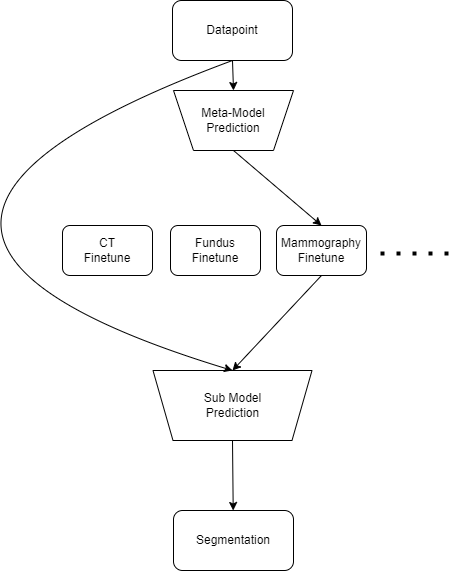
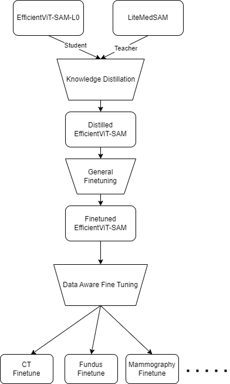

# CVPR24-MedSAM-on-Laptop

This repository contains the code for our submission to the CVPR 2024: SEGMENT ANYTHING IN MEDICAL IMAGES ON LAPTOP competition:

[DAFT: Data-Aware Fine-Tuning of Foundation Models for Efficient and Effective Medical Image Segmentation](https://openreview.net/pdf?id=PObXviy706)

### Environments and Requirements

We used two different environments, we trained on the [JUWELS Booster](https://en.wikipedia.org/wiki/JUWELS) (4x A100 40GB, Python 3.11.3, CUDA 12.2) using the packages in `train_requirements.txt` and converted the training checkpoints to OpenVINO IR artifacts on a local machine using `model_conversion_requirements.txt` and Python 3.10.13 on Ubuntu 22 LTS inside WSL.

We applied [this patch](https://github.com/facebookresearch/segment-anything/issues/277#issuecomment-1964762171) to the EfficientViT code, in the training environment, since certain batch sizes caused errors.

### Dataset and Models

+ download [the LiteMedSAM weights](https://drive.google.com/file/d/18Zed-TUTsmr2zc5CHUWd5Tu13nb6vq6z/view) and put them in `work_dir/LiteMedSAM/`, also download [the EfficientViT-SAM l0](https://huggingface.co/han-cai/efficientvit-sam/resolve/main/l0.pt) checkpoint
+ download the [training data](https://drive.google.com/drive/folders/1khEIdkO0MC_gG5EkQ7COdDS1jge5_XQs) (we only used the data provided by the organizers, no other external allowed datasets)
+ unzip all files, and move all npz files into one directory: `mv */*/*.npz all/`

### Preprocessing

+ we didn't do any further preprocessing outside the distillation/finetuning code
+ during distillation/finetuning we did the same as the [baseline training code](https://github.com/bowang-lab/MedSAM/blob/2a5a0556cabee8a62c8c1ec7e7cd821909adcb0c/train_one_gpu.py)
 + resize and pad images to 256x256
 + normalize intensities
 + flip horizontally with 50% probability
 + flip vertically with 50% probability
 + randomly pertubate the box by up to 5 pixels

### Training

The exact number of epochs for steps 1-3 and the data subsets used are listed in the table below. Make sure to use different workdirs for distillation, general finetuning and each subset finetuning run. Use the exact filenames from the table.
For XRay use `-datacsv train.csv` with `distill_fulldataset.py` and `finetune_npz_devit_fulldataset.py`, for all other models use the default (which is fulldataset.csv). Provide `-nopretrain` **only** for XRay and Microscopy when running `distill_fulldataset.py`.

| Model Name | CT | 3D | XRay | Dermoscopy | Endoscopy | Fundus | Microscopy | OCT | Mammography |
|---------------------------|----|----|-------|------------|-----------|--------|------------|-----|-------------|
| Knowledge Distillation Epochs    | 24 | 24 | 20    | 24         | 24        | 24     | 20         | 24  | 24          |
| General Fine-Tuning Epochs       | 24 | 24 | 46    | 24         | 0         | 24     | 20         | 24  | 24          |
| Data-Aware Fine-Tuning Epochs    | 4  | 3  | 0     | 0          | 0         | 24     | 50         | 24  | 24          |
| Data Subsets   | CT | CT&#124;MR&#124;PET | - | - | - | Fundus | Microscopy | OCT | Mamm |

1. use `python distill_fulldataset.py -num_epochs <num_epochs> -batch_size 7 -device cuda -work_dir <path_to_work_dir> -resume <path_to_work_dir>/medsam_lite_latest.pth -data_root <path_to_data> -pretrained_checkpoint <path_to_l0_checkpoint>` to distill the TinyViT in LiteMedSAM to EfficientViT, use `python modelmerge.py <path_to_work_dir>/medsam_lite_latest.pth <path_to_weights>` to create weights for EfficientViT-SAM by using the distilled EfficientViT image encoder checkpoint and copying the prompt encoder and mask decoder from LiteMedSAM
2. fine tune our the model from step 3 on all the data by using `python finetune_npz_devit_fulldataset.py -pretrained_checkpoint <path_to_weights> -num_epochs <num_epochs> -batch_size 96 -device cuda -work_dir <path_to_work_dir> -resume <path_to_work_dir>/medsam_lite_latest.pth -data_root <path_to_data>`, use `python extract_evit.py <path_to_work_dir>/medsam_lite_latest.pth <path_to_weights>` to extract the weights from the latest training checkpoint afterwards
3. fine tune our model from step 3 on different subsets of the data, depending on the modality, by using `finetune_npz_devit_fulldataset.py` (`finetune_npz_devit_fulldataset3D.py` for 3D modalities) and providing `-data_subset` (e.g. `-data_subset "CT|MR|PET"` or `-data_subset "Dermoscopy"`), afterwards use `python extract_evit.py <path_to_work_dir>/medsam_lite_latest.pth models/<model_name>.pth` to extract the weights from the checkpoints
4. convert all PyTorch models to ONNX by running `python export_onnx.py` after finishing step 1-3 for all models
5. convert ONNX to OpenVINO IR via `python onnx2openvino.py`
6. lastly, generate the litemedsam OpenVINO IR artifacts by running `python liteov.py` and move them to the other models via `mv liteov/* openvinomodels/`

You can now use `PerfectMetaOpenVINO.py` for inference.

The OpenVINO IR artifacts of our final submission are also available [here](https://drive.google.com/file/d/1OvQInteX8E4qWgDi4OQGCb1lKGL9t3qL/view?usp=sharing).

### Inference

Download the [demo data](https://drive.google.com/drive/folders/1t3Rs9QbfGSEv2fIFlk8vi7jc0SclD1cq) and run `python PerfectMetaOpenVINO.py`

### Evaluation

Run `python evaluation/compute_metrics.py -s test_demo/segs -g test_demo/gts -csv_dir ./metrics.csv`

### Results

We achieved first place on the [validation leaderboard](https://www.codabench.org/competitions/1847/#/results-tab) with following scores:

| Target     | DSC(%) | NSD(%) |
|------------|--------|--------|
| CT         | 93.14  | 95.48  |
| MR         | 88.21  | 91.73  |
| PET        | 71.46  | 56.31  |
| US         | 94.77  | 96.81  |
| X-Ray      | 77.07  | 82.83  |
| Dermoscopy | 94.97  | 96.41  |
| Endoscopy  | 96.60  | 98.61  |
| Fundus     | 95.59  | 97.16  |
| Microscopy | 80.86  | 87.14  |
| **Average**| **88.07** | **89.16** |

We have also been informed that we are in the top 5 on the final leaderboard.

### Docker submission

To create the docker you can use `./build_docker_openvino.sh` and `docker save automlfreiburg | gzip -c > automlfreiburg.tar.gz` to save it.

### Differences to the baseline

Compared, to the baseline we:
+ do data aware fine tuning (we use different weights for different modalities)
+ use EfficientViT-SAM architecture
+ use OpenVINO instead of the PyTorch runtime
+ avoid computing the same image embedding twice if a slice in a 3D datapoint is shared between boxes
+ fixed a bug that would assign all predictions of box 256 and above to 255
+ fixed a bug that would cause the overlay to be saved even if `--save_overlay` wasn't used (we actually removed all the overlay code in the end)
+ improved the docker container
  + use `python:3.11-slim` instead of `pytorch/pytorch:latest` (smaller and newer)
  + remove unused dependencies
  + use headless version of opencv
  + ignore all files except necessary ones
  + use [docker-squash](https://github.com/goldmann/docker-squash)

