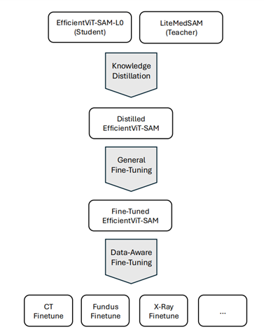

# CVPR24-MedSAM-on-Laptop

This repository contains the code for our submission to the CVPR 2024: SEGMENT ANYTHING IN MEDICAL IMAGES ON LAPTOP competition:

[DAFT: Data-Aware Fine-Tuning of Foundation Models for Efficient and Effective Medical Image Segmentation](https://openreview.net/pdf?id=PObXviy706)

The main branch contains the code of the performance booster challenge that followed the competition. Check out the [finalsubmission branch](https://github.com/automl/CVPR24-MedSAM-on-Laptop/tree/finalsubmission) for our final submission to the competition.

### Environments and Requirements

We trained on the [JUWELS Booster](https://en.wikipedia.org/wiki/JUWELS) (4x A100 40GB, Python 3.11.3, CUDA 12.2) using the packages in `requirements.txt`.

### Dataset and Models

+ download [the LiteMedSAM weights](https://drive.google.com/file/d/18Zed-TUTsmr2zc5CHUWd5Tu13nb6vq6z/view) and put them in `work_dir/LiteMedSAM/`, also download [the EfficientViT-SAM l0](https://huggingface.co/han-cai/efficientvit-sam/resolve/main/l0.pt) checkpoint
+ download the [training data](https://drive.google.com/drive/folders/1khEIdkO0MC_gG5EkQ7COdDS1jge5_XQs) (we only used the data provided by the organizers, no other external allowed datasets)
+ unzip all files
+ prepare the new datasets
 + `mv NewTrainingData/totalseg_mr MR`
 + `cd CVPR24-PostChallenge-Train/ && mkdir XRay PET`
 + `for file in *; do [ -f "$file" ] && mv "$file" "${file:3}"; done` (we want all files of a modality to have the modality name as prefix)
 + `mv X-Ray_Teeth_* XRay/ && mv PET_Lesion_psma_* PET/`

Now we just need to split the data into training and validation sets and foundation modalities for DAFT:
+ go to wherever you cloned the repository and run `python split_dataset.py <path_to_data>`
+ `cd datasplit && python modalities3D.py train.csv val.csv`

### Preprocessing

+ we didn't do any further preprocessing outside the distillation/finetuning code
+ during distillation/finetuning we did the same as the [baseline training code](https://github.com/bowang-lab/MedSAM/blob/2a5a0556cabee8a62c8c1ec7e7cd821909adcb0c/train_one_gpu.py)
 + resize and pad images to 256x256
 + normalize intensities
 + flip horizontally with 50% probability
 + flip vertically with 50% probability
 + randomly pertubate the box by up to 5 pixels

### Training

Make sure to use different workdirs for distillation, general finetuning and each DAFT run.

1. use `python distill.py -num_epochs 70 -batch_size 7 -device cuda -work_dir work_dir_distill/ -resume work_dir_distill/medsam_lite_latest.pth -pretrained_checkpoint l0.pt` to distill the TinyViT in LiteMedSAM to EfficientViT, use `python modelmerge.py work_dir_distill/medsam_lite_best.pth distilled.pth` to create weights for EfficientViT-SAM by using the distilled EfficientViT image encoder checkpoint and copying the prompt encoder and mask decoder from LiteMedSAM
2. fine tune our the model from step 3 on all the data by using `python finetune.py -pretrained_checkpoint distilled.pth -num_epochs 70 -batch_size 96 -device cuda -work_dir work_dir_general -resume work_dir_general/medsam_lite_latest.pth`, use `python extract_evit.py work_dir_general/medsam_lite_best.pth general_finetuned.pth` to extract the weights from the latest training checkpoint afterwards
3. fine tune our model from step 2 on different subsets of the data, depending on the modality, by using `python daft.py -pretrained_checkpoint general_finetuned.pth -num_epochs 70 -batch_size 96 -device cuda -work_dir work_dir_modalities3D/<modality>/ -resume work_dir_modalities3D/<modality>/medsam_lite_latest.pth --traincsv datasplit/modalities3D/<modality>.train.csv --valcsv datasplit/modalities3D/<modality>.val.csv`, afterwards use `mkdir models && ./extract_modalities3D.sh` to extract the weights from the checkpoints
4. `cp general_finetuned.pth models/general.pth` to use the generally finetuned model as a fallback if we can't read the modality from the file name
5. convert all PyTorch models to ONNX by running `python export_onnx.py`
6. `cd onnxmodels && mv 3D_prompt_encoder.onnx prompt_encoder.onnx && rm *_prompt_encoder.onnx &&  cd ..` since the prompt encoder is shared
7. convert ONNX to OpenVINO IR via `python onnx2openvino.py`

You can now use `PerfectMetaOpenVINO.py` for inference.

The OpenVINO IR artifacts of our performance booster submission and the distilled and generally finetuned models are also available [here](https://drive.google.com/drive/folders/1E763mmHuWghMt5Uv8lY96vRLZW6IYfLL?usp=sharing).

### Inference

Download the [demo data](https://drive.google.com/drive/folders/1t3Rs9QbfGSEv2fIFlk8vi7jc0SclD1cq) and run `python PerfectMetaOpenVINO.py`

Our C++ implementation is available in `cpp/`.

### Evaluation

Run `python evaluation/compute_metrics.py -s test_demo/segs -g test_demo/gts -csv_dir ./metrics.csv`

### Docker submission

To create the docker you can use `./build_docker_cpp.sh` (or `./build_docker_openvino.sh` for the python version) and `docker save automlfreiburg | gzip -c > automlfreiburg.tar.gz` to save it.
